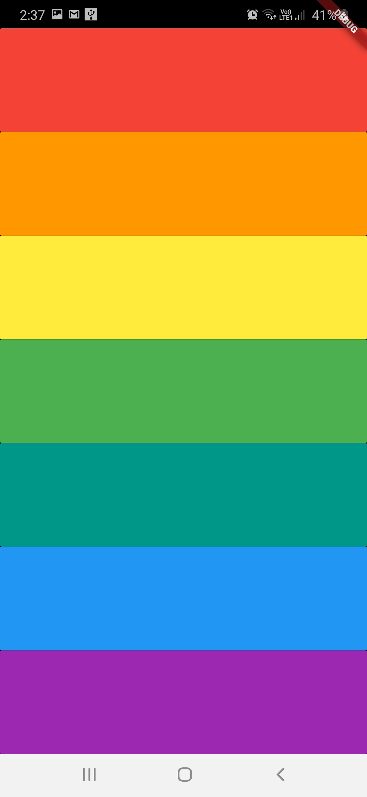

Installation

# flutter pub get

Usage

# flutter run

This is the Simple Music app in which when the user presses that button some sounds or music played in the background of that button...Don't forget to star ⭐ the repo it motivates me to share more open source

Created & Maintained By
<a href="https://www.linkedin.com/in/anikit-grover/#">Flutter Developer - Anikit Grover </a>

If you found this project helpful or you learned something from the source code and want to thank me, consider buying me a cup of ☕

